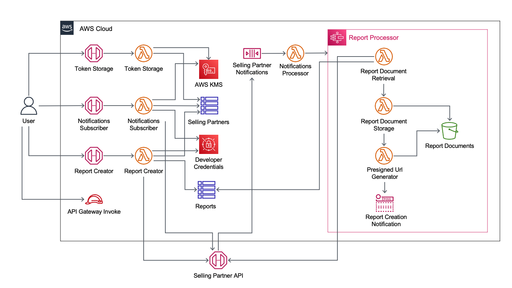

Deploying this Quick Start with default parameters builds the following {partner-product-short-name} environment in the AWS Cloud.

[#architecture1]
.Quick Start architecture for {partner-product-short-name} on AWS

As shown in <<architecture1>>, the Quick Start sets up the following:

The Quick Start sets up the following:

* Three Amazon API Gateway HTTP endpoints, providing REST APIs for three Lambda functions.
** Token storage to encrypt and store the selling partner's SP-API refresh token. 
** Notifications subscriber to subscribe the selling partner to the SP-API notifications.
** Report creator to submit report creation requests to the SP-API.
* An AWS IAM role to authenticate API Gateway requests.
* Two Amazon Dynamo DB tables, one for client tokens and another for report information.
* A selling partner notifications Amazon Simple Queue Service (Amazon SQS) queue to receive SP-API notifications.
* A notifications processor Lambda function to listen for SP-API messages and invoke an AWS Step Functions workflow.
* An AWS Step Functions workflow (Report processor) containing the following resources:
** A Report document retrieval Lambda function to retrieve report information from the SP-API.
** A Report document storage Lambda function to store reports in an Amazon Simple Storage Service (Amazon S3) bucket.
** A Presigned URL generator Lambda function to generate presigned URLs for the stored reports.
** An Amazon Simple Notification Service (Amazon SNS) topic to send email notifications of completed report processing.
** An Amazon S3 bucket to store reports.
* AWS Key Management Service (AWS KMS) to encrypt and decrypt client tokens.
* AWS Secrets Manager to store SP-API IAM user credentials and SP-API application credentials.